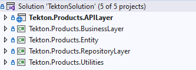
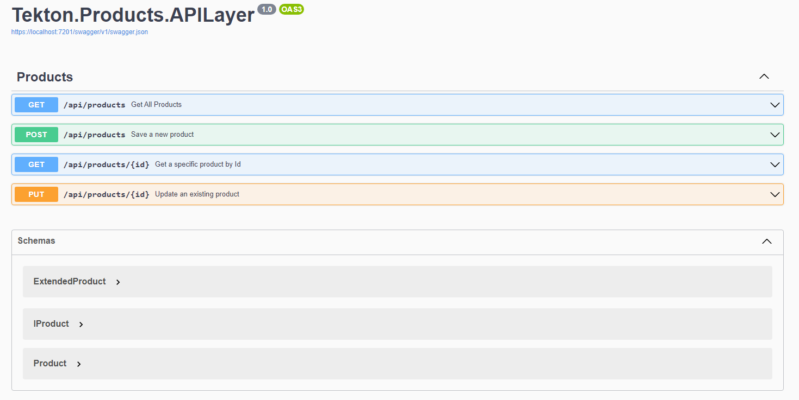

# TektonSolution

El API construida es una aplicación web basada en ASP.NET Core 8 que proporciona servicios para gestionar productos. Utiliza una arquitectura en capas para separar las responsabilidades y sigue los principios del patrón Repository para el acceso a la base de datos..

## Arquitectura y Patrones Utilizados

El proyecto sigue una arquitectura basada en capas y utiliza el patrón Repository junto con Entity Framework para la capa de datos. La lógica de negocio está encapsulada en servicios que siguen el patrón de diseño Service.

## Solución

La solución esta compuesta por 5 proyetos los cuales se describen a continuación:
1. Tekton.Products.APILayer: Capa de API. Contiene cada uno de los métodos que se exponen
2. Tekton.Products.BusinessLayer: Capa de negocio, se localiza la lógica de la solución
3. Tekton.Products.Entity: Capa transversal que provee entidas y sus interfaces
4. Tekton.Products.RepositoryLayer: Capa de persistencia
5. Tekton.Products.Utilities: Utilitarios 

## Configuración del Proyecto

### Requisitos Previos

Asegúrate de tener instalado lo siguiente:

- [ASP.NET Core SDK 8](https://dotnet.microsoft.com/download)
- [Visual Studio](https://visualstudio.microsoft.com/) o [Visual Studio Code](https://code.visualstudio.com/) (opcional)

### Configuración del Entorno

1. Clona el repositorio: `git clone https://github.com/crios/TektonSolution.git`
2. En el archivo appsettings.json ajusta el valor para la llave PathFileLog con una ruta local donde se guardará el log. 

### Configuración de la Base de Datos

1. Crea una base de datos Sql Server con el script:  Scripts BD/1. Create database.sql
2. Crea la tabla Productos con el script: Scripts BD/2. Create product table.sql
3. Abre el archivo `appsettings.json` y configura la cadena de conexión a tu base de datos.

### Ejecución del Proyecto

1. Desde la raíz del proyecto, ejecuta `dotnet run`.
2. Abre tu navegador y visita [https://localhost:5001/api/products](https://localhost:5001/api/products) para acceder a la API.

### Endpoints Principales

- `GET /api/products`: Obtiene la lista de todos los productos.
- `GET /api/products/{id}`: Obtiene detalles de un producto específico por su ID.
- `POST /api/products`: Crea un nuevo producto.
- `PUT /api/products/{id}`: Actualiza la información de un producto existente.
- `DELETE /api/products/{id}`: Elimina un producto existente.

### Interoperabilidades

[https://65d517a73f1ab8c6343689e0.mockapi.io/api/products/discounts/](https://65d517a73f1ab8c6343689e0.mockapi.io/api/products/discounts/): Devuelve el descuento para un productId especificado.

### Caché

El proyecto hace uso de El proyecto sigue IMemoryCache como proveedor de caché. El tiempo, nombre del key y el valor puede ser configurado desde el archivo `appsettings.json` 

### Vista inicial

